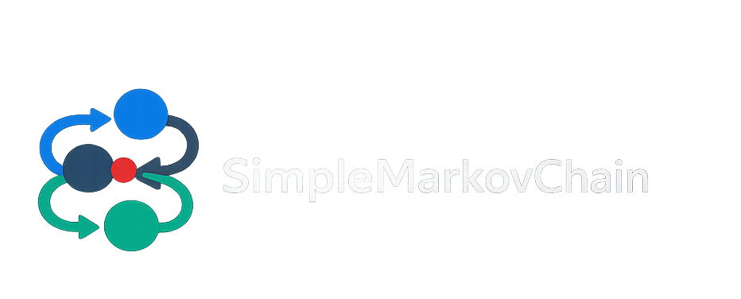

<p align="center">
  
</p>

<h1 align="center">🩸 Hemophilia Cost-Effectiveness Markov Model</h1>

<p align="center">
  A discrete-time Markov chain framework for health-economic modeling of hemophilia interventions, with full Probabilistic Sensitivity Analysis (PSA).
</p>

<p align="center">
  <a href="https://github.com/MohammadHashemian/SimpleMarkovChain/actions"></a>
  <a href="#"></a>
  <a href="#"></a>
  <a href="#"></a>
  <a href="#"></a>
  <a href="https://www.gnu.org/licenses/mit.html"></a>
</p>

---

## ✨ Overview

This project provides a **typed, reproducible, and extensible** discrete-time Markov chain (DTMC) engine purpose-built for **health-economic evaluation** of hemophilia treatments. It couples a robust simulation engine with rigorous uncertainty quantification — including **Probabilistic Sensitivity Analysis (PSA)**, **One-Way Sensitivity Analysis (OWSA)**, and **Bayesian meta-analysis** of clinical inputs.

The codebase is split into two clearly separated top-level packages:

- **`engine/`** — the **generic, domain-agnostic Markov engine** (the "API/Module"). Reusable for any DTMC/CTMC model. Depends only on `utils/`.
- **`app/`** — the **Hemophilia cost-effectiveness use case** (the "Example/Application"). All hemophilia-specific domain, analysis, persistence, visualization, data, and notebooks live here and depend on `engine/`.

This separation makes the engine a portable, reusable toolkit and the hemophilia study a self-contained application that demonstrates how to use it.

### 🔑 Key Features

- **⚙️ Flexible transition engine** — DTMC, CTMC, hybrid, and independent-hazard generators with automatic row-normalization and absorbing-state handling.
- **🚀 Vectorized batch engine** — Run thousands of structurally identical simulations in a single numpy sweep via `BatchMarkovChain` and `worker_function_batch`. Reduces a 10k-iter PSA from hours to minutes (12–17× speedup, see [⚡ Performance](#-performance)).
- **🎯 Domain-rich rewards** — Pettersson score, bleeding events, factor consumption, utility weights, and mortality modifiers — with both scalar and vectorized implementations sharing the same semantics.
- **📊 Uncertainty quantification** — PSA (Monte Carlo), OWSA (tornado diagrams), CEAC, and EVPI.
- **🔬 Bayesian foundation** — PyMC-driven posterior sampling and convergence diagnostics (R-hat, ESS, divergences).
- **🧱 Typed IO boundary** — Pydantic schemas validate every external input before it touches the engine.
- **🧪 269 passing tests** spanning the engine, use case, and shared utilities layers.

---

## 📂 Directory Layout

The repository is organised into **two top-level packages** plus shared infrastructure:

| Layer | Location | Responsibility |
|---|---|---|
| **🧩 Engine (API/Module)** | `engine/` | **Generic, reusable Markov engine.** No domain knowledge. |
| ↳ scalar runtime | `engine/chains.py` | `MarkovChains` + `Chain` — per-iteration DTMC runtime |
| ↳ vectorized runtime | `engine/vectorized.py` | `BatchMarkovChain` — n_iters in lockstep, single numpy sweep per step |
| ↳ transition generators | `engine/transitions.py` | DTMC / Hybrid / CTMC / Independent-hazard generators |
| ↳ modifier | `engine/modifier.py` | `TransitionModifier` protocol + `NoOpModifier` |
| ↳ runners | `engine/runners.py` | `Runner`, `ScenarioRunner` — process pools, chunked IPC, batch dispatch |
| ↳ result type | `engine/results.py` | `MarkovResult` — generic, frozen Pydantic output |
| **🦠 App (Use case / Example)** | `app/` | **Hemophilia cost-effectiveness study.** Everything hemophilia-specific. |
| ↳ domain | `app/domain/` | Health states, regime enums, scenarios, reward functions, worker glue |
| ↳ domain/rewards | `app/domain/rewards/` | Pettersson score, bleeding events, factor consumption, utility, mortality modifier |
| ↳ analysis | `app/analysis/` | PSA distributions, parameter sampling/resolution, Monte Carlo drivers |
| ↳ persistence | `app/persistence/` | Typed JSON loaders, Pydantic schemas, `ModelContext` aggregator |
| ↳ visualization | `app/visualization/` | Plotting functions and result visualisation utilities |
| ↳ notebook | `app/notebook/` | Helpers shared across notebooks (incl. `run_scenarios_in_batches`, `smoke`) |
| ↳ notebooks | `app/notebooks/` | Analysis notebooks (see [📓 Notebooks](#-notebooks)) |
| ↳ data | `app/data/` | Clinical parameters, costs, utilities, mortality tables, simulation config |
| ↳ outputs | `app/outputs/` | Generated figures, logs, and simulation results (gitignored) |
| **🛠️ Shared infrastructure** | `utils/`, `tests/`, `deprecated/` | Generic helpers, full test suite, legacy code |
| ↳ utils | `utils/` | Pure helper functions (math, transformations, decorators, path utilities) |
| ↳ tests | `tests/engine/`, `tests/app/`, `tests/utils/` | Pytest split to mirror the package layout |

> **Import rule:** `engine/` never imports from `app/`. `app/` may import from `engine/` and `utils/`. `utils/` imports from nothing in the project. This one-way dependency keeps the engine portable.

---

## 🧮 Transition Generators

The transition matrix is the heart of any discrete-time Markov cohort simulation. `engine/transitions.py` ships **four interchangeable generators** so the modeler can pick the right mathematical formalism for the problem at hand without re-writing the simulation pipeline. All four expose the same `build()` / `build_matrix()` API and produce a row-stochastic `(n_states, n_states)` matrix that the rest of the engine consumes.

### At a glance

| Generator | Inputs | Time semantics | Math basis | Use when |
|---|---|---|---|---|
| `DTMCTransitionGenerator` | Direct probabilities | Discrete steps, no rate conversion | `P[i, j] = p` as supplied | The model already has per-step probabilities (decision-model literature, calibration output) |
| `HybridTransitionGenerator` | Mix of direct probs + hazard rates | Per-time-step; weekly↔annual auto-scaled | Competing-risks proportional allocation on a single discrete step | Most hemophilia work — mixes direct `p_no_event` with hazard-driven transitions out of clinical states |
| `CTMCTransitionGenerator` | Hazard rates only | Continuous time, sampled at `Δt` (1/52 for weekly) | `P(Δt) = expm(Q · Δt)` with `Q` a true infinitesimal generator | Publication-grade rigor; competing risks reconciled through the matrix exponential (Chapman–Kolmogorov-consistent) |
| `IndependentHazardTransitionGenerator` | Hazard rates only | Per-time-step | `p_i = 1 − exp(−λ_i·Δt)`, `P[i, i] = exp(−Σλ·Δt)`, then renormalize | Familiar hazard-to-probability mental model; trades rigor for interpretability |

All four honor the optional `special_transitions={state: {target: prob}}` argument for fully specified rows (e.g. absorbing death, custom `lt_bleeding` mix). When a state appears in `special_transitions`, that row replaces any hazards defined for it.

### Math, in one paragraph each

**DTMC.** `P[i, j]` is whatever the user supplies. No transformation, no time scaling. Validation enforces that every non-special row sums to `1.0` and every entry lies in `[0, 1]`. The simplest, most defensible option when probabilities are already known.

**Hybrid.** Each `transition_pairs` entry is `(value, period)`. If `period == None`, the value is stored verbatim as a probability. Otherwise the value is a hazard rate; it is converted to a per-time-step rate (`rate / 52` for annual→weekly, `rate * 52` for weekly→annual) and then combined with the other outgoing hazards from the same state using the **competing-risks proportional allocation**:

```
total_λ = Σ λ_i
survival = exp(-total_λ)                    # for a one-unit time step
P[i, i] += remaining * survival
P[i, j]  += (λ_j / total_λ) * remaining * (1 - survival)
```

where `remaining = 1 − Σ direct probs`. The `1 − survival` is the standard closed-form probability that *some* competing event occurs in one step; the share going to each target is `λ_j / total_λ`. This is exact for one step under the constant-hazard assumption and an excellent approximation when `λ·Δt` is small (which it is for the weekly clinical rates used in this model).

**CTMC.** Builds the infinitesimal generator `Q` with off-diagonal `Q[i, j] = λ_{i→j}` and `Q[i, i] = −Σ_{j≠i} Q[i, j]` so every row sums to zero (the CTMC invariant). For `special_transitions`, the supplied probability `p` is inverted to an equivalent constant hazard via `λ = −ln(1−p) / Δt`, and the diagonal is set to `−Σ off-diag` so the row-sum invariant holds even when the row is not absorbing. The transition matrix is then `P(Δt) = expm(Q · Δt)`. This is the **mathematically rigorous** path: it satisfies the Chapman–Kolmogorov equation (`P(k·Δt) = P^k`) and reconciles competing risks through second- and higher-order interactions that the simpler generators ignore.

**Independent hazard.** Each outgoing hazard is converted independently: `p_i = 1 − exp(−λ_i·Δt)`, and the survival is `P[i, i] = exp(−Σλ·Δt)`. The row is then **renormalized** because, when many large hazards compete, `Σ(1 − exp(−λ_i·Δt)) + exp(−Σλ·Δt)` can exceed `1`. The renormalization forces the row sum to 1, which means the reported probabilities are not the same as the raw formulas above (this is the "approximation" the docstring warns about). For typical clinical rates the renormalization factor is within `1e-4` of `1`, but the deviation grows with the number and magnitude of competing risks.

### Equivalence and divergence

For a **single hazard** with no other transitions and no specials, all four generators reduce to the same `1 − exp(−λ·Δt)` (Hybrid via the rate-as-probability path; CTMC and IndHazard via `Δt` scaling; DTMC after manual pre-computation). For a **single absorbing state** (self-loop `= 1`), all four yield `P[i, i] = 1` regardless of input. The four generators diverge as soon as **competing risks** appear:

- **No competing risks** → all four agree to within FP noise.
- **Mild competing risks** (small `λ·Δt`) → all four agree; the CTMC `expm` series is dominated by its linear term.
- **Strong competing risks** → CTMC is the most accurate; Hybrid's proportional allocation is a first-order approximation; IndHazard overestimates the total transition mass and relies on renormalization.

### Bug history

A **subtle bug** in `CTMCTransitionGenerator` (pre-fix) left `Q[i, i] = 0` for non-absorbing `special_transitions` rows, so the generator row sum was positive instead of zero. The matrix exponential then produced **wrong self-loop probabilities** for any state like `lt_bleeding` whose spec includes multiple non-trivial targets — the self-loop was over by ≈ 4×. The bug was masked by the final `P / row_sums` renormalization in `build()`, which only forces row sums to 1 but does not recover the correct per-entry values. The fix in `engine/transitions.py:_build_generator_matrix` now sets `Q[i, i] = −Σ off-diag` for all rows, and a regression test in `tests/engine/test_transition_generators.py::TestCTMCMath::test_special_non_absorbing_state_q_row_sums_to_zero` pins it.

### Choosing one

The default for this project is `HybridTransitionGenerator`, wired through `app/domain/transitions.py::build_transition_matrix` — it handles the real hemophilia spec where some transitions are direct probabilities (the "no event" probability `exp(−wbr)`) and others are weekly rates. Switch to `CTMCTransitionGenerator` for any publication-grade competing-risks analysis; switch to `IndependentHazardTransitionGenerator` for quick, interpretable baselines; switch to `DTMCTransitionGenerator` when the underlying data is already in probability form.

### Quick start

```python
from engine.transitions import (
    DTMCTransitionGenerator,
    HybridTransitionGenerator,
    CTMCTransitionGenerator,
    IndependentHazardTransitionGenerator,
)

# Pure discrete-time, direct probabilities.
P = DTMCTransitionGenerator(
    states=["healthy", "bleeding", "death"],
    transition_pairs={
        ("healthy", "healthy"): 0.85,
        ("healthy", "bleeding"): 0.13,
        ("healthy", "death"):    0.02,
        ("bleeding", "healthy"): 0.80,
        ("bleeding", "bleeding"): 0.18,
        ("bleeding", "death"):   0.02,
    },
).build_matrix()

# Hybrid: direct prob + hazards, weekly time step.
P = HybridTransitionGenerator(
    states=["healthy", "bleeding", "hemarthrosis", "lt_bleeding", "death"],
    transition_pairs={
        ("healthy", "bleeding"):     (0.05,  "weekly"),
        ("healthy", "hemarthrosis"): (0.02,  "weekly"),
        ("healthy", "lt_bleeding"):  (0.005, "weekly"),
        ("healthy", "death"):        (0.0001, "weekly"),
        ("bleeding", "healthy"):     (0.90, None),  # direct probability
    },
    special_transitions={
        "death": [0.0, 0.0, 0.0, 0.0, 1.0],  # absorbing
    },
    time_step="weekly",
).build_matrix()

# CTMC: matrix exponential on the infinitesimal generator.
P = CTMCTransitionGenerator(
    states=["healthy", "bleeding", "death"],
    transition_pairs={
        ("healthy", "bleeding"): 6.0,    # weekly hazard
        ("healthy", "death"):    0.05,
        ("bleeding", "death"):   0.1,
    },
    time_step="weekly",
).build_matrix()

# Independent hazard: simple p_i = 1 - exp(-λ_i·Δt) + renormalize.
P = IndependentHazardTransitionGenerator(
    states=["healthy", "bleeding", "death"],
    transition_pairs={
        ("healthy", "bleeding"): 6.0,
        ("healthy", "death"):    0.05,
    },
    time_step="weekly",
).build_matrix()
```

### Test coverage

The math is pinned by `tests/engine/test_transition_generators.py` (54 tests): identity / row-stochasticity / absorbing-state behavior for each generator, hazard→probability closed forms, generator-matrix invariants (row sums to zero, `Q[i, i] = −Σ off-diag`), `P = expm(Q·Δt)`, Chapman–Kolmogorov consistency, and cross-generator agreement on single-hazard cases. The CTMC special-transition regression test (`test_special_non_absorbing_state_q_row_sums_to_zero`) protects the fix described above.

---

## 📓 Notebooks

| Notebook | Purpose |
|---|---|
| `app/notebooks/00_poisson_mass_functions.ipynb` | Poisson mass function validation for bleeding event distributions |
| `app/notebooks/01_preprocessing.ipynb` | Data preprocessing and parameter derivation |
| `app/notebooks/01b_mortality_iran.ipynb` | UN WPP 2024 mortality reconstruction for Iran, derivation of the `app/data/mortality_iran.json` table |
| `app/notebooks/02_meta_analysis.ipynb` | Bayesian meta-analysis of clinical inputs |
| `app/notebooks/03_psa_simulation.ipynb` | Probabilistic sensitivity analysis (10,000 iterations, vectorized batch engine) |
| `app/notebooks/04_owsa_simulation.ipynb` | One-way sensitivity analysis simulation |
| `app/notebooks/05_psa_analysis.ipynb` | PSA result analysis (CEAC, EVPI, scatter plots) |
| `app/notebooks/07_owsa_analysis.ipynb` | OWSA result analysis (tornado diagrams) |

> **Reproducibility note.** Both PSA (`03`) and OWSA (`04`) notebooks derive per-scenario RNG seeds from the env seed in `app/data/simulation.json` using `utils.stable_hash` (a CRC-32–based, cross-process-stable hash). Do not use Python's built-in `hash()` for this — it is randomized per process by `PYTHONHASHSEED` and will silently break reproducibility.

---

## ⚡ Performance

The codebase ships with **two execution paths** for the Markov simulation:

| Path | Module | Use case | Behavior |
|---|---|---|---|
| **Scalar** | `engine/chains.py` — `MarkovChains` | Small-scale runs, custom reward logic, debugging | One Python iteration per (iter, step); full reward-fn flexibility |
| **Vectorized** | `engine/vectorized.py` — `BatchMarkovChain` | PSA, OWSA, any batch of homogeneous simulations | Stacks `n_iters` per-iter state into `(n_iters, n_states)` arrays; one numpy op per step across all iters |

Both paths share the **same domain semantics** — the vectorized reward functions in `app/domain/rewards/vectorized.py` mirror the scalar ones in `app/domain/rewards/scalar.py` bit-for-bit (within sampling noise), so results are statistically equivalent.

### Measured speedup

Head-to-head on a real hemophilia 8-state chain with the full reward + mortality-modifier workload:

| Scenario | Steps | Scalar (per iter) | Vectorized (per iter) | Speedup |
|---|---|---|---|---|
| Early (10 yrs, weekly) | 520 | 37.8 ms | 2.30 ms | **16.5×** |
| Lifetime (98 yrs, weekly) | 5096 | 85.2 ms | 6.66 ms | **12.8×** |

For the Heavy PSA workload (10,000 iters across 18 scenarios), this drops end-to-end runtime from **hours to ~20 minutes** on a single core, with linear scaling on multi-core pools.

### How to use the vectorized path

In any notebook or script, pass `engine="batch"` to the scenario runner and supply the `batch_worker_function`:

```python
from engine.chains import Chain
from engine.runners import ScenarioRunner, SimulationResult
from app.domain.scenario import ScenarioBundle
from app.domain.inputs import ModelInput
from app.domain.worker import worker_function, worker_function_batch
from app.persistence.context import ModelContext
from app.notebook.scenario_runner import run_scenarios_in_batches

run_scenarios_in_batches(
    bundles=bundles,
    context=context,
    identity_chain=identity_chain,
    batch_size=4,
    engine="batch",                          # <- was: "pathos" or "multiprocessing"
    worker_function=worker_function,         # kept for backwards compat
    batch_worker_function=worker_function_batch,  # <- new
    output_dir=...,
    temp_dir=...,
)
```

Internally, the runner creates a per-scenario `enlighten` progress bar that reports `X/n_iters iter` with an ETA and throughput, e.g.:

```
Batch Simulation | early on-demand bayesian | 10000 iters  30%|███   | 3000/10000 iter [00:06<00:14, 500.00 iter/s]
```

### Where the speedup comes from

- **Step loop is O(steps), not O(n_iters × steps).** The hot inner loop runs once per simulated step, doing one numpy op over `(n_iters, n_states)` arrays.
- **Vectorized absorbing-state check** via a precomputed boolean mask per chain.
- **Vectorized mortality modifier** — only applied at year boundaries (51 of every 52 weeks are a no-op).
- **Vectorized categorical sampling** via cumsum + uniform draws (`argmax(u < cumsum)`).
- **Vectorized reward functions** — `weight`, `event_count`, `pettersson_score`, `consumption`, `utility` all operate as numpy ufuncs on `(n_iters,)` arrays.
- **Plus** the scalar-path micro-optimizations in `MarkovChains.walk` and `Runner._run_with_pool` (cached worker kwargs, pre-resolved absorbing mask, no-conditions / NoOp-modifier fast paths, `chunksize` on `imap_unordered`, no `copy.deepcopy` in the worker entrypoint).

### Adding a new vectorized reward function

The `BatchMarkovChain.walk_batch` step loop calls store and reward functions with this signature:

```python
def fn(step: int,
       state_idx: np.ndarray,         # (n_iters,) current state index per iter
       store_arrays: dict,            # previously-computed store values
       shared_kwargs: dict,           # per-batch constants
       rng: np.random.Generator) -> np.ndarray:  # returns (n_iters,) array
```

To add a new vectorized reward, write a function with this signature and pass it via the `store_funcs` / `reward_funcs` dict to `walk_batch` (or extend the `VECTORIZED_STORE_FUNCS` / `VECTORIZED_REWARD_FUNCS` registries in `app/domain/rewards/vectorized.py`).

### Progress callback for custom runners

`walk_batch` and `worker_function_batch` accept a `progress_callback(step, total_steps)` that fires every `progress_every` steps. This is what the bundled `_run_batch` uses to drive the `enlighten` bar; custom runners can use it to wire their own progress reporting without modifying the engine.

---

## 🚀 Getting Started

### Prerequisites

- Python **3.11** or **3.14**
- `pip` and a virtual environment tool

### Installation

```powershell
# Create and activate a virtual environment
python -m venv .venv
.venv\Scripts\activate

# Install the package with development, notebook, and ML extras
pip install -e ".[dev,notebooks,ml]"
```

<details>
<summary>🧪 Running the test suite & coverage</summary>

```powershell
# Run all tests verbosely
pytest tests/ -v

# Run with coverage across both packages + shared utilities
pytest tests/ --cov=engine --cov=app --cov=utils --cov-report=term
```

The test suite is split to mirror the package layout:

- `tests/engine/` — pure-engine tests (chains, vectorized, transitions, transition generators)
- `tests/app/` — use-case tests (hemophilia domain, analysis, persistence, notebook tools)
- `tests/utils/` — shared-helper tests (math, decorators)

</details>

<details>
<summary>🎨 Linting & type checks</summary>

```powershell
ruff check engine/ app/ utils/ tests/
mypy .
```

</details>

---

## 🔄 Data Flow

```
app/data/*.json ──> app/persistence/loaders.py ──> ModelContext ──> Scenario ──> ParameterSet
                                                                       │
                                                                       ▼
app/notebooks/ <── ModelOutput <── worker_function(_batch) <── ParameterResolver
                                    ▲                ▲
                                    │                │
                         engine.MarkovChains.walk   engine.BatchMarkovChain.walk_batch
                                    ▲                ▲
                                    └────── engine.TransitionGenerator ──────┘
                                                  │
                                                  ▼
                                  app/analysis/ (ICER, QALY, CEAC, EVPI)
                                                  │
                                                  ▼
                                  app/visualization/ (plots and figures)
```

`app.notebook.scenario_runner.run_scenarios_in_batches` dispatches each scenario to one of two execution paths:

- **`engine="multiprocessing"` / `engine="pathos"`** — **scalar path.** Each `ModelInput` is shipped to a worker process and run through `engine.MarkovChains.walk` + `app.domain.worker.worker_function`. Best when reward logic is custom or non-vectorizable.
- **`engine="batch"`** — **vectorized path.** The full input list for a scenario is processed in one call to `app.domain.worker.worker_function_batch`, which stacks the per-iter state into `(n_iters, n_states)` arrays and walks all iters in lockstep. ~13–17× faster for the standard hemophilia workload — see [⚡ Performance](#-performance).

---

## 🏛️ Design Principles

- **🔌 Two-package separation** — The generic engine (`engine/`) is decoupled from the hemophilia use case (`app/`). Adding a new use case (e.g. diabetes model) is a matter of creating a new top-level package, not editing the engine.
- **🔌 IO boundary separation** — All external data enters exclusively through `app/persistence/`.
- **🧼 Domain purity** — Clinical logic is isolated and independently testable in `app/domain/`.
- **🧩 Engine isolation** — Markov execution is fully decoupled from economic analysis.
- **🔁 Reproducibility-first PSA** — Every stochastic input is structured, typed, and seedable.
- **📒 Notebook-driven analysis** — Experiments live in `app/notebooks/`, never in ad-hoc scripts.

---

## 📄 License

Released under the [MIT License](https://www.gnu.org/licenses/mit.html).

<p align="center">
  <sub>Built for transparent, reproducible health-economic research.</sub>
</p>
